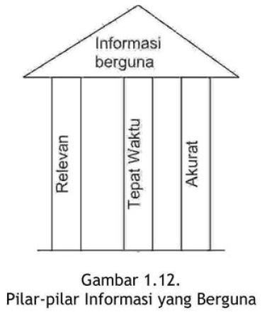
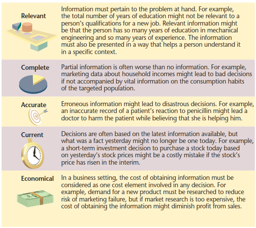
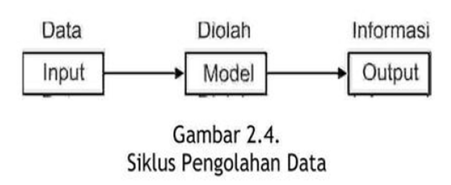
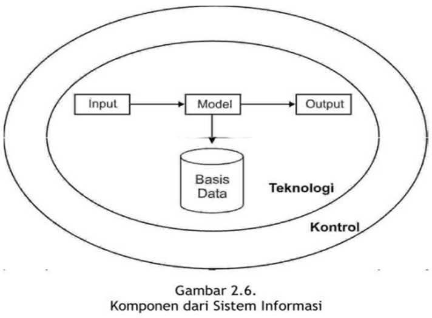
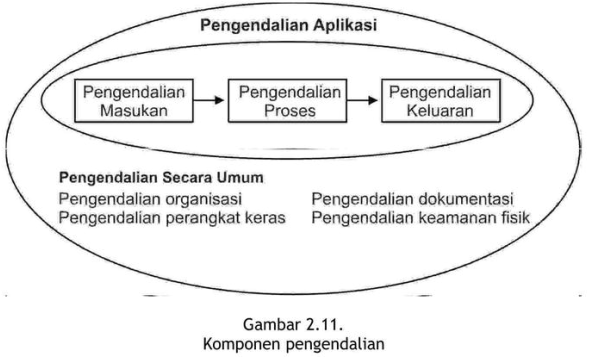

```{r setup, include=FALSE}
knitr::opts_chunk$set(echo = FALSE)
```

## Capaian Pembelajaran

Setelah mempelahari dengan baik modul ini, mahasiswa diharapkan `mampu` 

- [x] menjelaskan pengertian dan arti penting sistem informasi bagi organisasi
- [x] menjelaskan perkembangan dari sistem informasi
- [x] menjelaskan peran-peran dari sistem informasi
- [x] menjelaskan konsep sistem informasi manajemen
- [x] menjelaskan kerangka kerja sistem informasi
- [x] menjelaskan rancang bangun dan komponen-komponen sistem informasi
- [x] menjelaskan integrasi sistem informasi
- [x] menjelaskan model pengolahan data
- [x] menjelaskan model matematika
- [x] menjelaskan model logikal
- [x] menunjukkan contoh-contoh aplikasi sistem informasi dalam organisasi
- [x] menjelaskan sistem informasi dan organisasi.

---

## KEGIATAN BELAJAR 1
### PERKEMBANGAN SISTEM INFORMASI

A. ERA AKUNTANSI DAN OPERASIONAL

- Perkembangan sistem teknologi informasi terkait sangat erat dengan perkembangan sistem komputer.
- Coba perhatikan spek komputer pertama:
  + It weighed more than 27 tons
  + Size: roughly 2.4 m × 0.9 m × 30 m, occupied 167 m2 
  + Consumed 150 kW of electricity.
  + Cost: equivalent to $7,195,000 in 2019
  
  `Source: wikipedia`

B. ERA INFORMASI

C. ERA JEJARING

D. ERA JEJARING GLOBAL

E. ORGANISASI SISTEM TEKNOLOGI INFORMASI

F. PERAN MANAJER SISTEM TEKNOLOGI INFORMASI

- Masih ingat tiga pilar kualitas sistem informasi? tepat kepada orangnya atau relevan (relevance), tepat waktu (timeliness), dan tepat nilainya atau akurat (accurate). 
- Keluaran yang tidak didukung oleh ketiga pilar ini tidak dapat dikatakan 
sebagai informasi yang berguna, tetapi merupakan sampah (garbage).

```{r out.width="60%", echo=FALSE}

```

- Sekarang kita perluas dengan menambahkan dua komponen lagi:

```{r out.width="70%",echo=FALSE}

```
`Sumber: Sousa, Kenneth (2015)`


---

## KEGIATAN BELAJAR 2
### KOMPONEN-KOMPONEN SISTEM INFORMASI

```{r out.width="70%", echo=FALSE}

```
Apakah komponen pada Gambar 2.4 sudah cukup?

- Perlu komponen menyimpan data yang belum diolah (basis data), sehingga membentuk Gambar 2.5.

```{r out.width="70%", echo=FALSE}
knitr::include_graphics("25-siklus-pengolahan-data-ext.png")
```

Apakah komponen pada Gambar 2.5 sudah cukup?

- Bagaimana menghasilkan informasi yang relevan? Perlu model
- Bagaimana menghasilkan informasi yang tepat waktu? Perlu teknologi
- Bagaimana menghasilkan informasi yang akurat? Perlu kontrol
- Sehingga modelnya kita perluas menjadi Gambar 2.6:

```{r out.width="60%", echo=FALSE}

```

A. KOMPONEN INPUT: 

- Bahan dasar untuk diolah menjadi informasi
- Most data an organization uses as input to its Information system are generated and collected within the organization. 
- These data elements result from transactions undertaken in the course of doing
business. A transaction is a business event: a sale, a purchase, a payment, the hiring of a new employee, and the like. T
- These transactions can be recorded on paper and later entered into a computer system; directly recorded through a transaction processing systems (TPS), such
as a point-of-sale (POS) machine, scanner, or camera; or captured online when someone transacts through the web. 
- A TPS is any system that records transactions. 
- Often, the same system also processes the transactions, summarizing and routing information to other systems; therefore, these systems are transaction processing systems, not just transaction recording systems.
- External data sources can also be used by organisations such as :
  + Customers, competitors, and suppliers
  + Government agencies and financial institutions
  + Labor and population statistics
  + Economic conditions

B. KOMPONEN OUTPUT: 

- Informasi yang berguna sesuai konteksnya.
- The information an IS displays in the format most useful to an organization. 
- The most widely used output device is the video display, or video monitor, which
displays output visually. 
- Another common output device is the printer, used to print hard copies of information on paper. 
- However, computers can communicate output through speakers in the form of music or speech and also can transmit it to another computer or electronic device in computer-coded form, for later interpretation.

C. KOMPONEN BASIS DATA:

- A database, the heart of an information system, is a collection of all relevant data organized in a series of integrated files.
- To create, organize, and manage databases, a database management system (DBMS) is used, such as Microsoft Access or FileMaker Pro for home or small-office use. In a
large organization, a DBMS such as Oracle or IBM DB2 might be used.

D. KOMPONEN MODEL: model logika, model matematika

E. KOMPONEN TEKNOLOGI: mempercepat proses pengolahan data

F. KOMPONEN KONTROL: menjamin informasi yang dihasilkan oleh sistem informasi akurat

```{r out.width="60%", echo=FALSE}

```


G. KOMPONEN MANUSIA


```{r out.width="60%", echo=FALSE}
knitr::include_graphics("212-komponen-manusia.png")
```
