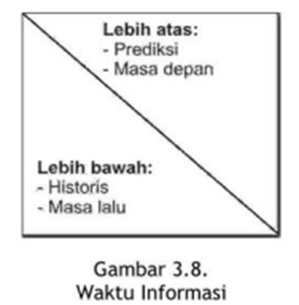

```{r setup, include=FALSE}
knitr::opts_chunk$set(echo = FALSE)
```

## Pendahuluan

Modul ini akan membahas pengambilan keputusan manajemen. Manajemen membutuhkan informasi sebagai dasar pengambilan keputusan. Sistem informasi mempunyai peran penting dalam menyediakan informasi untuk semua tingkatan.

Setelah mempelahari dengan baik modul ini, Anda diharapkan `mampu` 

- [x] menjelaskan pelaku-pelaku atau aktor-aktor yang berkaitan atau yang berkepentingan dalam SIM, mulai dari *top, middle* dan *lower management*.
- [x] menjelaskan konsep dasar pengambilan keputusan
- [x] menjelaskan hubungan antara atau arti penting sistem informasi bagi pengambilan keputusan
- [x] menjelaskan tipe kegiatan manajemen,
- [x] menjelaskan tipe keputusan manajemen,
- [x] menjelaskan peran manajemen dalam sistem informasi,
- [x] menjelaskan pengaruh gaya kognitif dalam pengambilan keputusan
- [x] menjelaskan tipe informasi yang diperlukan manajemen,
- [x] menjelaskan karakteristik informasi manajemen pada organisasi,
- [x] menjelaskan model logikal
- [x] menunjukkan contoh-contoh aplikasi sistem informasi dalam organisasi
- [x] menjelaskan metode pemilihan alternatif informasi dalam pengambilan keputusan.

---

## KEGIATAN BELAJAR 1
### Pengambilan Keputusan Manajemen

**A. TIPE KEGIATAN MANAJEMEN**

1. Manajemen tingkat atas: perencanaan strategis
  a. Proses evaluasi lingkungan organisasi
  b. Penetapan tujuan
  c. Penentuan strategi
2. Manajemen tingkat menengah: pengendalian manajemen, meyakinkan organisasi menjalankan strategi yang ditetapkan dengan efektif dan efisien.
3. Manajemen tingkat bawah: pengendalian operasi, meyakinkan tugas-tugas dilaksanakan secara efektif dan efisien.


---

**B. TIPE KEPUTUSAN MANAJEMEN**


---

**C. PERAN MANAJEMEN**

- hubungan personal: figur kepala, pemimpin, penghubung
- peran informasi: menerima dan menyebarkan informasi, juru bicara
- peran keputusan: entrepreneur, menangani gangguan, mengalokasikan sumberdaya, negosiator.

**D. GAYA KOGNITIF PENGAMBILAN KEPUTUSAN**
- Tahap: inteligence, design, choice, dan implementation

---

## KEGIATAN BELAJAR 2
### Informasi untuk Pengambilan Keputuasan Manajemen

**A. TIPE INFORMASI**


---

**B. KARAKTERISTIK INFORMASI**

1. Kepadatan Informasi


---

2. Luas Informasi


---

3. Frekuensi Informasi


---

4. Skedul Informasi


---

5. Waktu Informasi



---

6. Akses Informasi
7. Sumber Informasi


---

**C. SISTEM-SISTEM INFORMASI DI FUNGSI-FUNGSI ORGANISASI**


