```{r setup, include=FALSE}
knitr::opts_chunk$set(echo = FALSE)
```

## PENDAHULUAN

Modul membahas teknologi yang digunakan di sistem informasi manajemen. Teknologi itu dapat berupa teknologi sistem komputer. Teknologi sistem komputer terdiri dari hardware dan software yang bersama-sama membentuk suatu sistem.

Sesudah mempelajari dengan baik modul ini, Anda diharapkan mampu:

:::obj

1. menjelaskan sifat output;
2. menjelaskan pusat unit pemrosesan;
3. menjelaskan teknologi komputer;
4. menjelaskan sistem hardware;
5. menjelaskan sistem software;
6. menjelaskan sistem operasi komputer;
7. mengetahui sistem operasi komputer;
8. mengetahui sistem jaringan komputer;
9. mengetahui generasi-generasi bahasa program;
10. mengetahui bahasa-bahasa program.

:::

## KEGIATAN BELAJAR 1: TEKNOLOGI PERANGKAT KERAS (*HARDWARE*)

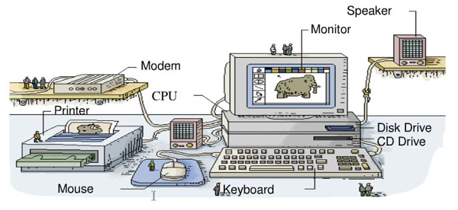


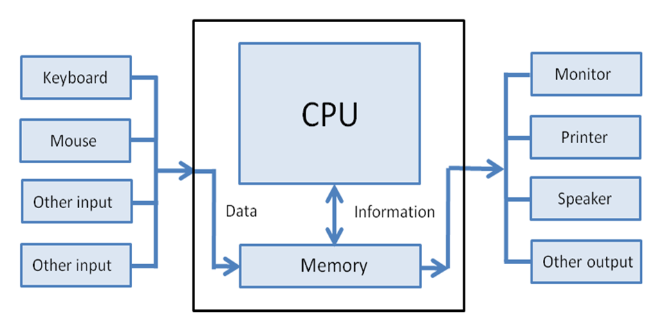


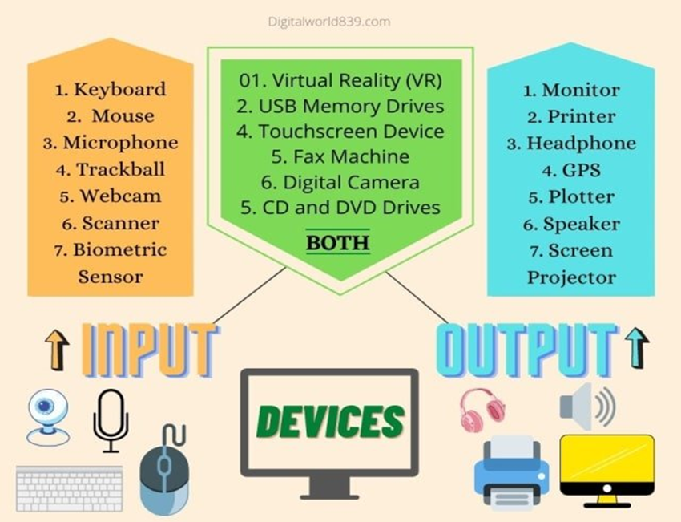


1. ALAT MASUKAN/*INPUT DEVICE*

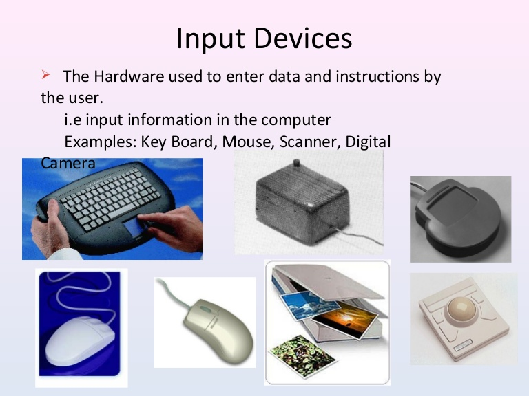


2. ALAT PEMROSES

3. ALAT KELUARAN

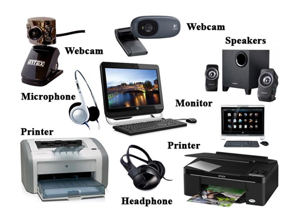

4. ALAT SIMPANAN LUAR

5. UKURAN MEMORI

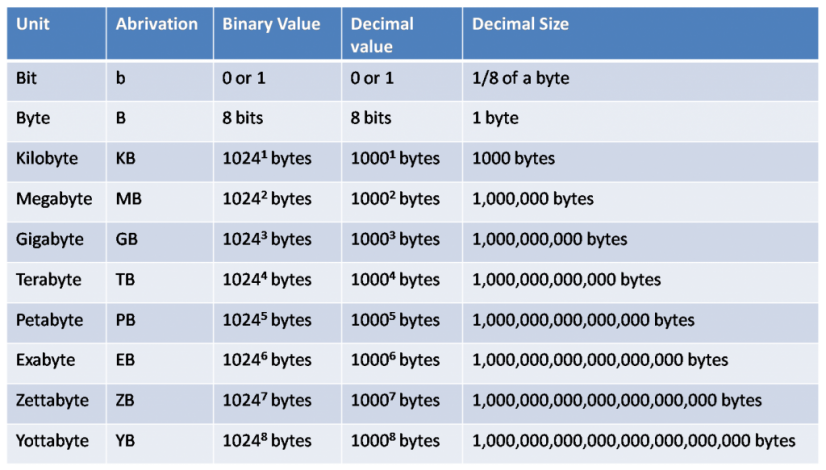

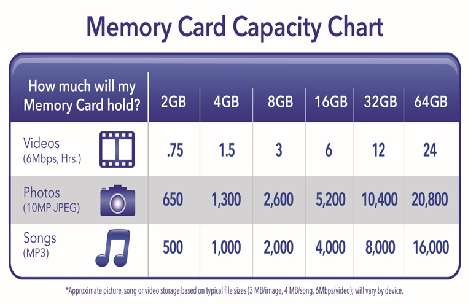


6. UKURAN KECEPATAN PROSES

7. KLASIFIKASI KOMPUTER

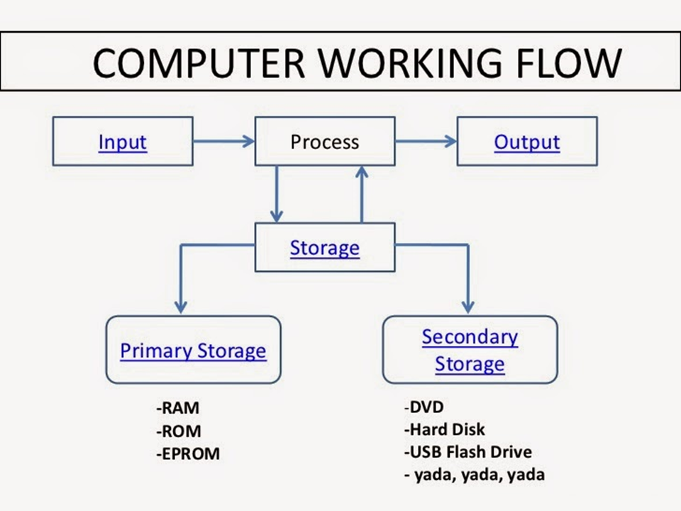
 
 
## KEGIATAN BELAJAR 2: TEKNOLOGI PERANGKAT LUNAK

### SISTEM OPERASI

- menghubungkan perangkat lunak (software) dengan perangkat keras (hardware)
- sistem operasi memberikan perintah dan sebagai mediator antara manusia dengan computer
- mengendalikan dan mengkoordinasi kegiatan operasi dari sistem komputer

#### Jenis sistem operasi
- MS DOS (Disk Operating System)
- Sistem Operasi Windows
- Sistem Operasi Linux
- Sistem Operasi MacOS

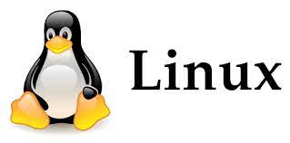

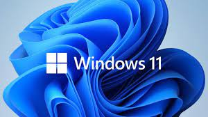

### SISTEM BANTUAN

- text  editor  ( di  Windows  adalah  notepad), 
- beberapa  bantuan  untuk  menangani  disk  (misalnya  memformat,  menyalin, mengecek disk  dan  lain  sebagainya),  
- menangani  file  (mengurutkan  isi  file, mencari file),  menangani tampilan (menyetel ukuran layar)  dan penanganan peralatan lainnya.


### SOFTWARE BAHASA (LANGUAGE SOFTWARE)

- Bahasa  mesin  (machine  language)
- bahasa  perakit  (assembly  language)
- bahasa tingkat  tinggi  (high  level  language): FORTRAN, COBOL,  PASCAL,  dan  C  language;
- bahasa tingkat sangat tinggi (very high-level language)

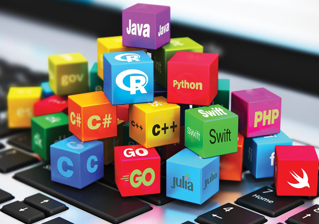

### PERANGKAT LUNAK APLIKASI

- Statistik: SPSS, Stata, Minitab, Eviews, R, Gauss, Matlab
- Keuangan dan Akuntansi
- MSDM
- Browser: Firefox, Google Chrome,...
- dll
