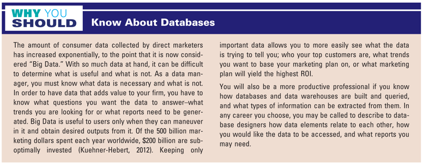
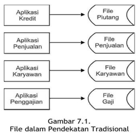
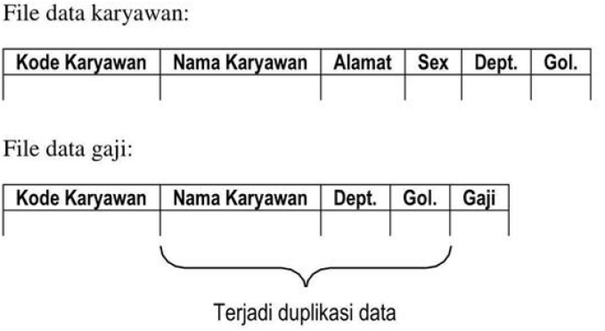
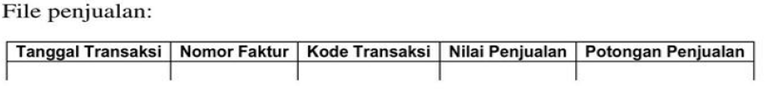
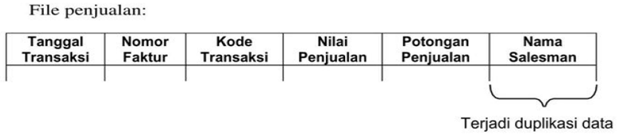
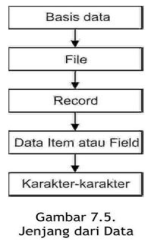
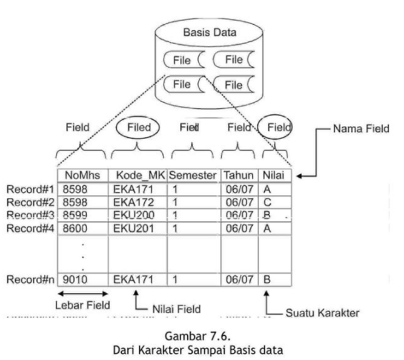
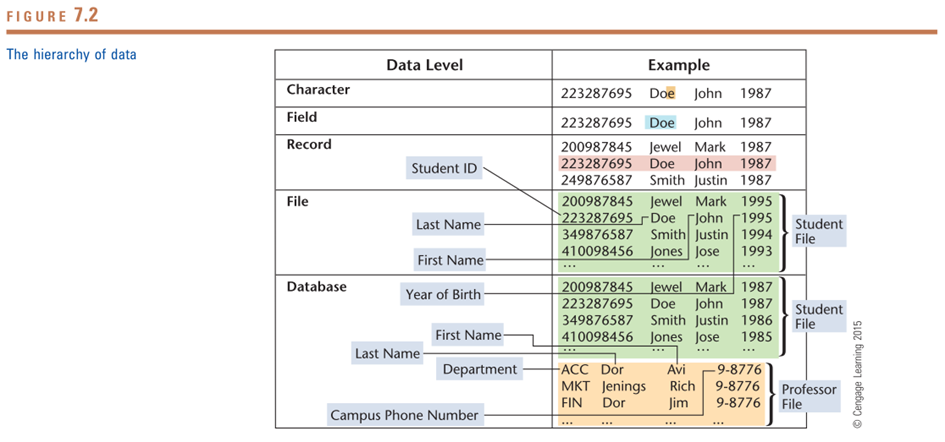
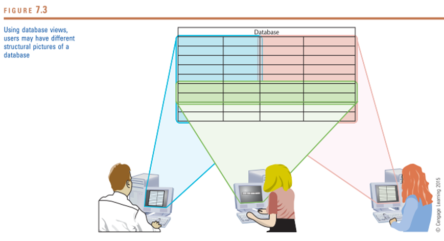
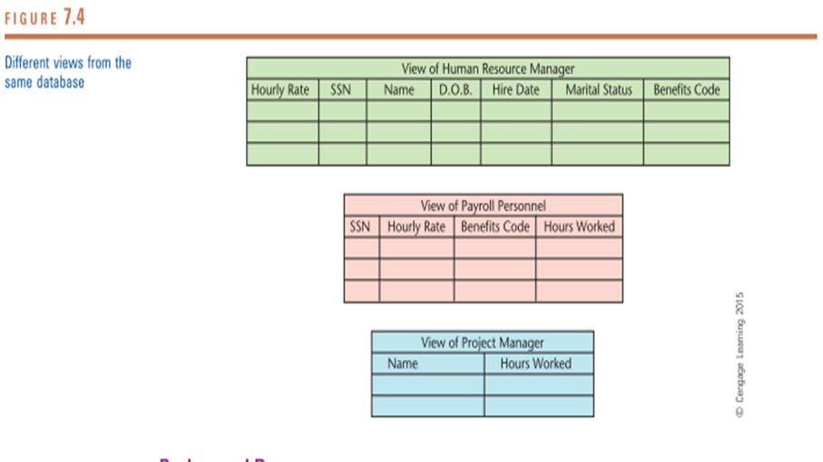

```{r setup, include=FALSE}
knitr::opts_chunk$set(echo = FALSE)
```

## PENDAHULUAN

modul ini akan membahas tentang basis data (database). Basis data merupakan komponen yang penting di sistem informasi. Tanpa basis 
data maka tidak akan dapat dihasilkan informasi yang dibutuhkan tepat waktu 
karena basis data adalah sumber utama dari informasi. 

Sesudah mempelajari dengan baik modul ini, Anda diharapkan mampu: 

:::obj

1. menjelaskan konsep basis data; 
2. menjelaskan perbedaan antara pendekatan tradisional dan pendekatan 
basis data; 
3. memahami jenjang dari data; 
4. memahami macam-macam file yang ada; 
5. membedakan basis data logikal dan basis data fisik; 
6. mengetahui proses basis data; 
7. mengetahui organisasi basis data; 
8. mengetahui software pendukung basis data; 
9. mengetahui penggunaan perangkat lunak basis data; 
10. mengetahui basis data sebagai pendukung sistem informasi; 
11. mengetahui basis data multidimensi; 
12. menjelaskan administrasi basis data; 
13. menjelaskan struktur basis data; 
14. menjelaskan organisasi dan manajemen basis data. 

:::

<br />

## KEGIATAN BELALAJAR 1: Konsep Basis Data 

### A. DEFINISI BASIS DATA 

**Think about web browser**

- To communicate with others,
- To visit our favourite online sports store to search for mountain-bike
- We enter a price range, models, etc…
- Within a few seconds, the screen is filled with details on available models complete with product photos and specifications.

--> Where did this rich, well-organized information come from? Databases

--> Combined with interactive webpages on the Internet, databases have made an immense contribution to commerce.

– >  online banking, consumer catalogs, search engines, stock brokerages, or social media.

--> Their impact on business has allowed fewer people to complete larger tasks, and their power has enabled organizations to learn more consumers

- Every time you enter the address of a website, a special program performs a search in a huge database and matches your request with one of hundreds of millions of addresses.

- Every time you fill out an online form with details such as your address, phone number, or credit-card number, a program feeds the data into a database, where each item is recorded for further use.

<br />


<br />

- Basis data (database) merupakan kumpulan dari data yang saling 
berhubungan satu dengan yang lainnya, tersimpan di perangkat keras 
komputer dan digunakan perangkat lunak untuk memanipulasinya. 

- Basis data komponen yang penting dalam sistem informasi 
karena menyediakan informasi bagi para pemakai. 

- Penerapan basis data dalam sistem informasi disebut dengan database 
system. 
- Sistem basis data (database system) adalah suatu sistem informasi 
yang mengintegrasikan kumpulan dari data yang saling berhubungan satu 
dengan yang lainnya dan membuatnya tersedia untuk beberapa aplikasi yang 
bermacam-macam di dalam suatu organisasi.

<br />

### B. PENDEKATAN TRADISIONAL DAN PENDEKATAN BASIS DATA

- Pendekatan tradisional mengumpulkan data ke dalam file-file yang tidak 
berhubungan satu dengan yang lainnya. 

- Biasanya tiap-tiap file dirancang untuk aplikasi yang tertentu. 


```{r out.width="50%"}

```


<br />

#### Kelemahan Pendekatan Tradisional

- Terjadi duplikasi data (data redundancy)



- Tidak terjadi hubungan data (data reliability). 




### Pendekatan basis data

1. Duplikasi data (data redundancy) dikurangi.
   Karena basis data merupakan kumpulan dari semua data secara umum 
maka dapat digunakan bersama-sama untuk semua aplikasi sehingga 
duplikasi data dapat dikurangi. 

2. Hubungan data (data reliability) dapat ditingkatkan 
   Karena data dikumpulkan bersama-sama maka hubungan dari data dapat 
ditingkatkan, yang berarti data di file tertentu dapat dihubungkan dengan 
data di file-file lainnya. 

<br />

C. JENJANG DATA 

- Sampai dengan membentuk suatu basis data, data mempunyai jenjang 
mulai dari karakter-karakter (characters), item data (data item atau field), 
record, file dan kemudian basis data.


```{r out.width="50%"}

```










