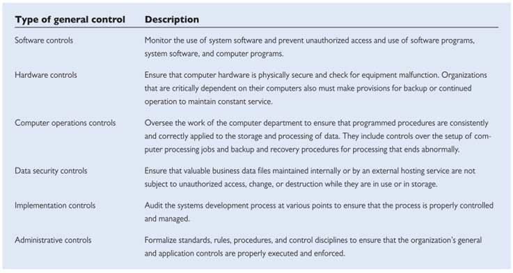
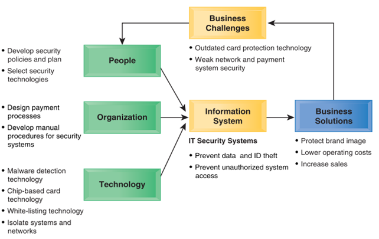
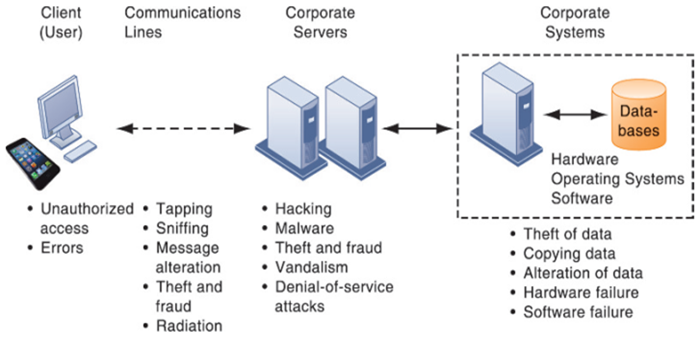
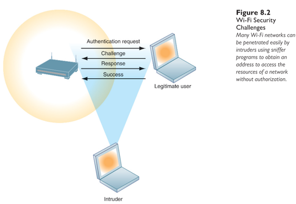
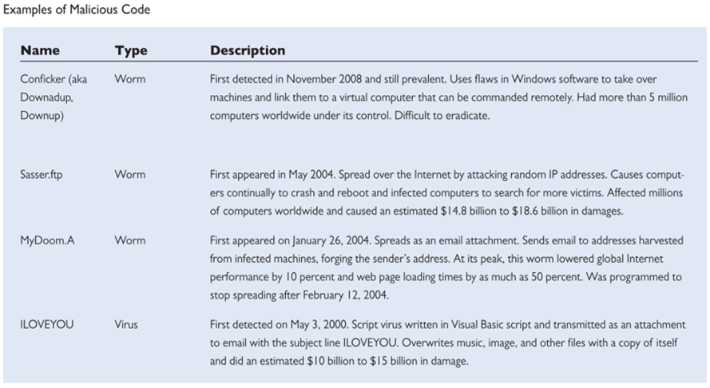
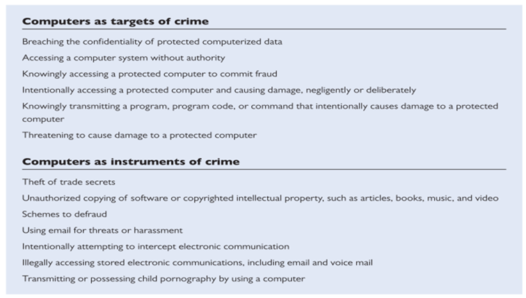
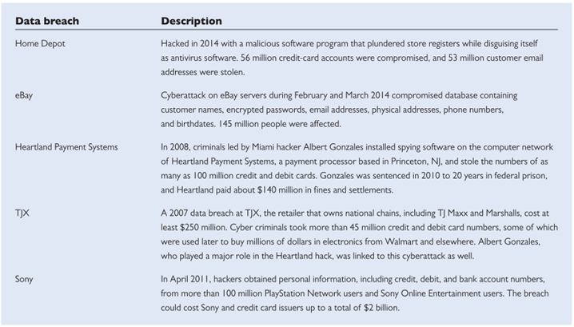
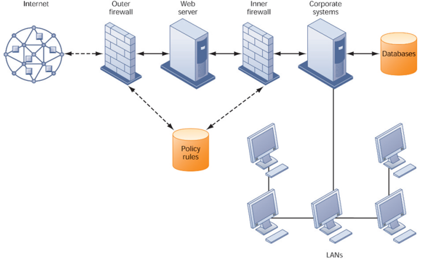
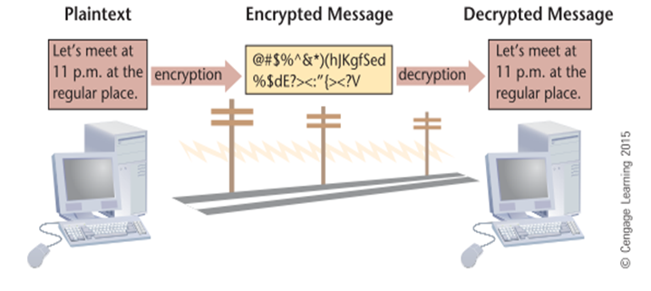

```{r setup, include=FALSE}
knitr::opts_chunk$set(echo = FALSE)
```
## PENDAHULUAN

Sesi ini akan membahas Pengendalian Sistem lnformasi, Internet dan E-business yang mencakup Modul 8 dan 9.


### MODUL 8 Pengendalian Sistem lnformasi

Modul ini akan membahas pengendalian yang harus dipasang di sistem informasi. Tujuan dari sistem informasi tidak akan mengena jika sistem ini terganggu sehingga sistem informasi harus mempunyai pertahanan terhadap gangguan-gangguan tersebut dan pertahanan itu harus dilakukan terus-menerus.

Sesudah mempelajari dengan baik modul ini, Anda diharapkan mampu:

1. menjelaskan pengendalian umum;
2. menjelaskan pengendalian manajemen;
3. menjelaskan pengendalian organisasi;
4. menjelaskan pengendalian dokumen sistem;
5. menjelaskan pengendalian perubahan program hardware dan software;
6. menjelaskan pengendalian akses;
7. menjelaskan pengendalian otorisasi input;
8. menjelaskan pengendalian komunikasi data;
9. menjelaskan pengendalian pengolahan;
10. menjelaskan pengendalian output.

### KEGIATAN BELAJAR 1 Pengendalian secara Umum

- Pengendalian-pengendalian secara umum terdiri dari beberapa bagian,
yaitu sebagai berikut ini.

1. Pengendalian organisasi.
2. Pengendalian dokumentasi.
3. Pengendalian kerusakan perangkat keras.
4. Pengendalian keamanan fisik.
5. Pengendalian keamanan data.

### Information systems controls



<br />




<br />

#### Why are information systems vulnerable to destruction, error, and abuse?

- When large amounts of data are stored in  electronic form:
  + Through communications networks, information  systems in different locations are interconnected
  + The potential for unauthorized access, abuse, or fraud is not limited to a single location but can occur at any access point in the network
  
#### Contemporary security challenges and vulnerabilities



<br />

### PENGENDALIAN KEAMANAN DATA

#### Internet Vulnerabilities

- Large public networks, such as the Internet, are more vulnerable than internal networks because they are virtually open to anyone.
  + The Internet is so huge that when abuses do occur, they can have an enormously widespread impact.
  + Widespread  use  of  email,  instant  messaging  (IM),  and  peer-to-peer  (P2P)  file-sharing  programs

<br />

#### Wireless Security Challenges



<br />

#### Malicious software: Viruses, Worms,  trojan horses, and spyware

- Social networking sites such as Facebook, Twitter, Instagram and LinkedIn become new conduits for malware.



<br />

#### Hackers and Computer Crime

- A hacker is an individual who intends to gain unauthorized access to a computer system:
  + spoofing and sniffing
  + denial-of-service attacks (DoS)
  + identity theft

#### Computer Crime




<br />

#### Data Breach




<br />


#### Firewalls

- Firewalls prevent unauthorized users from accessing private networks.
- A firewall is a combination of hardware and software that controls the flow of incoming and outgoing network traffic.



#### Encrypting Communications



#### Pengendalian kerusakan perangkat keras

- Natural Disasters
- Blackouts and Brownouts
- Vandalism

**SOLUSI**

1. Pengawasan terhadap pengaksesan fisik
   a. Penempatan satpam.
   b. Pengisian agenda kunjungan.
   c. Penggunaan tanda pengenal.
   d. Pemakaian kartu.
   e. Penggunaan Closed-Circuit Television.
   f. Penggunaan pengracik kertas.
   g. Tersedianya pintu arah yang membuka ke luar.

2. Pengaturan lokasi fisik

   a. Lokasi yang tidak terganggu oleh lingkungan.
   b. Gedung yang terpisah.
   c. Tersedia fasilitas cadangan.

3. Penerapan alat -alat pengaman
4. Stabilizer
5. Air Conditioner (AC)
6. Pendeteksi kebakaran.

<br />

--> Pemisahan tugas dan tanggung jawab di antara departemen/di dalam departemen sangat penting

Fungsi-fungsi utama yang perlu dipisahkan tugas dan tanggung jawabnya:

- bagian pengontrol data,
- bagian yang mempersiapkan data, 
- bagian operasi komputer, 
- bagian pustaka data, 
- bagian pemrogram dan pengembangan sistem, dan
- bagian pusat informasi (information center).

### Modul 9: Internet dan E-business

--> Modul ini akan membahas internet, penerapannya ke e-commerce.

--> Penggunaan internet untuk kegiatan bisnis ini disebut dengan e-commerce atau e-business: B2C, B2B

#### TIPOLOGI MODEL-MODEL BISNIS

1. Agora adalah suatu e-commerce yang merupakan suatu tempat di mana
pembeli dan penjual bertemu untuk melakukan transaksi. Contohnya,
e-bay, bukalapak, shopee, tokopedia...apa lagi?
2. Aggregasi (aggregation) adalah e-commerce yang menggabungkan
(aggregasi) beberapa pemasok ke dalam satu buah toko online yang
nyaman. Contohnya, amazon.com.
3. Aliansi (alliance) adalah kerja sama beberapa anggota untuk mencapai
tujuan tertentu.
4. Rantai nilai (value chain) adalah jaringan integrasi vertikal yang
menambah nilai ke input berikutnya.
5. Jaringan distribusi (distributive network) menyediakan jasa
mengalokasikan dan mendistribusikan daripada memproduksi dan
membeli barang-barang, jasa dan informasi. Contohnya, WSprldCom
dan UPS.

--> Apakah pembagian ini masih berlaku?

#### PENCIPTAAN NILAI

--> Pros and Cons dari transaksi online?


