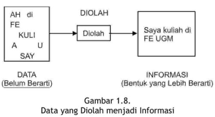

### Tujuan Pembelajaran

Semua yang ada di dunia ini dapat dilihat sebagai sebuah sistem. Untuk memahami sistem dapat dengan mempelajari definisi atau karakternya.

Sesudah mempelajari dengan baik modul ini Anda diharapkan mampu:

1. menjelaskan definisi sebuah sistem;
2. menjelaskan perbedaan sistem fisik dan sistem prosedural;
3. menjelaskan karakteristik dari suatu sistem;
4. menjelaskan klasifikasi sistem;
5. menjelaskan pengendalian sistem;
6. memahami pengendalian pencegahan;
7. memahami pengendalian umpan balik;
8. memahami pengendalian umpan maju;
9. menjelaskan definisi informasi;
10. mengetahui mutu sebuah informasi;
11. mengetahui arti penting suatu informasi bagi organisasi;
12. menjelaskan jenis sistem dan subsistem informasi;
13. menjelaskan pengendalian dalam sistem;
14. mengetahui penilaian sebuah informasi.

---

**KEGIATAN BELAJAR 1**

### Pengertian Sistem

A. PENDEKATAN PEMAHAMAN SISTEM

- Pendekatan prosedur: sistem sebagai kumpulan dari prosedur-prosedur yang mempunyai tujuan tertentu. 
- Pendekatan komponen: sistem adalah kumpulan dari komponen yang saling berhubungan satu dengan yang lainnya membentuk satu kesatuan untuk mencapai tujuan tertentu.

> Manakah dari pendekatan ini yang benar?

---

B. DEFINISI SISTEM

- Secara umum, suatu sistem terdiri dari struktur dan proses. 

- Beberapa definisi dari sistem menyebutkan bahwa sistem terdiri dari struktur dan proses.
- Akan tetapi, beberapa definisi dari sistem hanya menyebutkan kumpulan dari struktur atau proses saja.
- Sistem yang didefinisikan sebagai kumpulan dari struktur bukan berarti sistem tersebut tidak mempunyai proses.
- Sistem yang strukturnya lebih dominan dari prosesnya adalah sistem fisik.
- Beberapa definisi sistem hanya menyebutkan suatu sistem merupakan kumpulan dari proses saja. 
- Sistem yang prosesnya lebih dominan dari struktumya adalah sistem prosedural.

> Cek beberapa definisi sistem di BMP

---

### Definisi mana yang akan digunakan? *Checklist*:

- Apakah suatu sistem kumpulan dari komponen-komponen atau kumpulan-kumpulan dari proses-proses?
- Untuk sistem fisik yang memang terdiri dari banyak komponen-komponen fisik maka pendekatan komponen lebih tepat. 
- Untuk sistem prosedural yang memang terdiri dari banyak proses-prosesnya maka pendekatan prosedur lebih tepat digunakan. 

- Untuk mempelajari sistem informasi manajemen, yang merupakan sistem fisik maka pendekatan komponen yang lebih tepat digunakan. 

- Pendekatan komponen ini akan lebih mengena juga di dalam mempelajari suatu sistem untuk tujuan analisis dan perancangan sistem informasi. 
  - Untuk menganalisis dan merencanakan suatu sistem, analis, dan perancang sistem harus mengerti terlebih dahulu mengenai komponen- komponen atau elemen-elemen atau subsistem-sub-sistem dari sistem tersebut.
  
---

C. KARAKTERISTIK SISTEM

Karakteristik sistem:

1. komponen-komponen (components), 
2. batas sistem (boundary),
3. lingkungan luar sistem (environments), 
4. penghubung (interface), 
5. masukan (input), 
6. keluaran (output), 
7. pengolah (process) dan 
8. sasaran (objectives) atau tujuan (goal).

 
---
 
D. KLASIFIKASI SISTEM
 
 1. sistem abstrak (abstract system) dan sistem fisik (physical system).
 2. sistem alamiah (natural system) dan sistem buatan manusia (human made system).
 3. sistem tertentu (deterministic system) dan sistem tak tentu (probabilistic system).
 4. sistem tertutup (closed system) dan sistem terbuka (open system)
 
---
 
E. PENGENDALIAN SISTEM
 
- pengendalian umpan balik (feedback control system),

 

- pengendalian umpan maju (feed forward control system)

  - mencoba mendorong proses dari sistem supaya menghasilkan hasil balik yang positif
  - Supaya keluaran dapat dihasilkan umpan balik yang positif maka pengendalian tidak boleh diukur dari keluarannya, tetapi diukur dan dikendalikan dari prosesnya. 
  - Selama proses terjadi di dalam sistem, selalu dilakukan pengamatan dan cepat-cepat diatasi apabila mulai terjadi penyimpangan sebelum terlanjur fatal pada keluarannya. 

- pengendalian pencegahan (preventive control system): pengendalian pencegahan mencoba untuk mengendalikan sistem di muka sebelum proses dimulai dengan mencegah hal-hal yang merugikan untuk masuk ke dalam sistem.

---

**KEGIATAN BELAJAR 2**

A. Konsep Dasar Informasi

- Informasi (information) adalah sebagai data yang diolah ke dalam bentuk yang berguna bagi para pemakainya.
- Data adalah kenyataan yang menggambarkan suatu kejadian-kejadian dan kesatuan nyata.
- Data merupakan bentuk yang masih mentah, belum dapat berceritera banyak sehingga perlu diolah lebih lanjut.
- Kejadian-kejadian (event) adalah sesuatu yang terjadi pada saat yang tertentu.
 

B. SIKLUS INFORMASI

**C. KUALITAS INFORMASI**

- Tiga pilar: tepat kepada orangnya atau relevan (relevance), tepat waktu 
(timeliness), dan tepat nilainya atau akurat (accurate). 
- Keluaran yang tidak didukung oleh ketiga pilar ini tidak dapat dikatakan 
sebagai informasi yang berguna, tetapi merupakan sampah (garbage).

<!-- AddToAny BEGIN -->

<!-- AddToAny END -->

