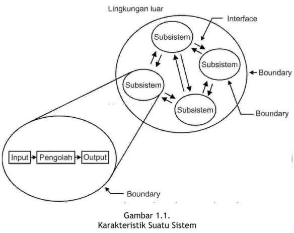
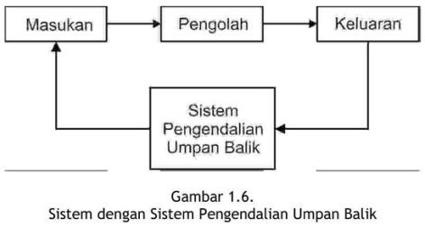
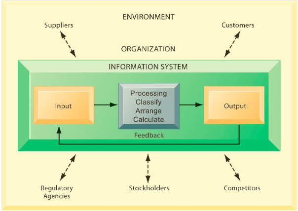
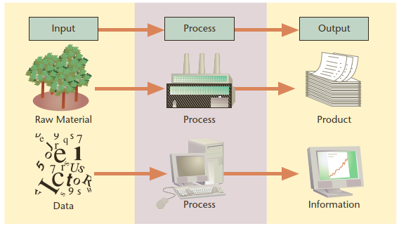
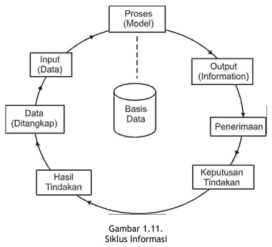

```{r load_packages, echo=FALSE}
library ('fontawesome')
```

### `r fa("readme")` Capaian Pembelajaran


Semua yang ada di dunia ini dapat dilihat sebagai sebuah sistem. Untuk memahami sistem dapat dengan mempelajari definisi atau karakternya.

Sesudah mempelajari dengan baik modul ini Anda diharapkan mampu:

- [x] menjelaskan definisi sebuah sistem;
- [x] menjelaskan perbedaan sistem fisik dan sistem prosedural;
- [x] menjelaskan karakteristik dari suatu sistem;
- [x] menjelaskan klasifikasi sistem;
- [x] menjelaskan pengendalian sistem;
- [x] memahami pengendalian pencegahan;
- [x] memahami pengendalian umpan balik;
- [x] memahami pengendalian umpan maju;
- [x] menjelaskan definisi informasi;
- [x] mengetahui mutu sebuah informasi;
- [x] mengetahui arti penting suatu informasi bagi organisasi;
- [x] menjelaskan jenis sistem dan subsistem informasi;
- [x] menjelaskan pengendalian dalam sistem;
- [x] mengetahui penilaian sebuah informasi.

---

## `r emo::ji('books')` KEGIATAN BELAJAR 1

### Pengertian Sistem

A. PENDEKATAN PEMAHAMAN SISTEM

- Pendekatan prosedur: sistem sebagai kumpulan dari prosedur-prosedur yang mempunyai tujuan tertentu. 
- Pendekatan komponen: sistem adalah kumpulan dari komponen yang saling berhubungan satu dengan yang lainnya membentuk satu kesatuan untuk mencapai tujuan tertentu.

> Manakah dari pendekatan ini yang benar?

---

B. DEFINISI SISTEM

- Secara umum, suatu sistem terdiri dari struktur dan proses. 

- Beberapa definisi dari sistem menyebutkan bahwa sistem terdiri dari struktur dan proses.
- Akan tetapi, beberapa definisi dari sistem hanya menyebutkan kumpulan dari struktur atau proses saja.
- Sistem yang didefinisikan sebagai kumpulan dari struktur bukan berarti sistem tersebut tidak mempunyai proses.
- Sistem yang strukturnya lebih dominan dari prosesnya adalah sistem fisik.
- Beberapa definisi sistem hanya menyebutkan suatu sistem merupakan kumpulan dari proses saja. 
- Sistem yang prosesnya lebih dominan dari struktumya adalah sistem prosedural.

> Cek beberapa definisi sistem di BMP

---

### Teknologi Informasi dan Sistem Informasi

- Information technology (IT) consists of all the hardware and software that 
a firm needs to use to achieve its business objectives. 
  - This includes not only computers, disk drives, and mobile handheld devices but also software, such as the Windows or Linux operating systems, the Microsoft Office desktop productivity suite, and the many thousands of computer programs that can be found in a typical large firm
- Information systems are more complex and can be understood best by looking at 
them from both a *technology* and a *business* perspective.
- An information system (IS) can be defined technically as a set of interrelated components that collect (or retrieve), process, store, and distribute information to support decision making, coordinating, and control in an organization. 
  - In addition, information systems may also help managers and workers analyse problems, visualize complex subjects, and create new products.

---

### Definisi mana yang akan digunakan? *Checklist*:

- Apakah suatu sistem kumpulan dari komponen-komponen atau kumpulan-kumpulan dari proses-proses?
- Untuk sistem fisik yang memang terdiri dari banyak komponen-komponen fisik maka pendekatan komponen lebih tepat. 
- Untuk sistem prosedural yang memang terdiri dari banyak proses-prosesnya maka pendekatan prosedur lebih tepat digunakan. 
- Untuk mempelajari sistem informasi manajemen, yang merupakan sistem fisik maka pendekatan komponen yang lebih tepat digunakan. 
- Pendekatan komponen ini akan lebih mengena juga di dalam mempelajari suatu sistem untuk tujuan analisis dan perancangan sistem informasi. 
  - Untuk menganalisis dan merencanakan suatu sistem, analis, dan perancang sistem harus mengerti terlebih dahulu mengenai komponen- komponen atau elemen-elemen atau subsistem-sub-sistem dari sistem tersebut.
  
---

C. KARAKTERISTIK SISTEM

Karakteristik sistem:

1. komponen-komponen (components), 
2. batas sistem (boundary),
3. lingkungan luar sistem (environments), 
4. penghubung (interface), 
5. masukan (input), 
6. keluaran (output), 
7. pengolah (process) dan 
8. sasaran (objectives) atau tujuan (goal).


 
---
 
D. KLASIFIKASI SISTEM
 
 1. sistem abstrak (abstract system) dan sistem fisik (physical system).
 2. sistem alamiah (natural system) dan sistem buatan manusia (human made system).
 3. sistem tertentu (deterministic system) dan sistem tak tentu (probabilistic system).
 4. sistem tertutup (closed system) dan sistem terbuka (open system)
 
---
 
E. PENGENDALIAN SISTEM
 
- pengendalian umpan balik (feedback control system),

 

- pengendalian umpan maju (feed forward control system)

  - mencoba mendorong proses dari sistem supaya menghasilkan hasil balik yang positif
  - Supaya keluaran dapat dihasilkan umpan balik yang positif maka pengendalian tidak boleh diukur dari keluarannya, tetapi diukur dan dikendalikan dari prosesnya. 
  - Selama proses terjadi di dalam sistem, selalu dilakukan pengamatan dan cepat-cepat diatasi apabila mulai terjadi penyimpangan sebelum terlanjur fatal pada keluarannya. 

- pengendalian pencegahan (preventive control system): pengendalian pencegahan mencoba untuk mengendalikan sistem di muka sebelum proses dimulai dengan mencegah hal-hal yang merugikan untuk masuk ke dalam sistem.

---

## Tiga kegiatan di dalam sistem informasi 

- Sistem informasi mengandung informasi tentang organisasi dan lingkungannya. 
- Tiga aktivitas yang menghasilkan informasi yang diperlukan organisasi untuk membuat keputusan, mengendalikan operasi, menganalisis persoalan dan menciptakan produk atau layanan baru: input, processing, and output. 
- Masukan/input captures or collects raw data from within the organization or from 
its external environment. 
- Pengolahan/processing converts this raw input into a meaningful form. 
- Keluaran/output transfers the processed information to the people who will use it or to the activities for which it will be used. Information systems also require feedback, which is output that is returned to appropriate members of the organization to help them evaluate or correct the input stage.
- Umpan balik/feedback is output returned to appropriate people or activities in the organization to evaluate and refine the input. 
- Pelaku di lingkungan luar organisasi/environmental actors, such as customers, suppliers, competitors, stockholders, and regulatory agencies, interact with the organization and its information systems.

```{r out.width= "120%", echo=FALSE}

```
`Sumber: Laudon, Kenneth C., and Jane P. Laudon (2017)`

---

## `r emo::ji('books')`KEGIATAN BELAJAR 2

A. Konsep Dasar Informasi

- Information systems contain information about significant people, places, and 
things within the organization or in the environment surrounding it. 
- Information: data that have been shaped into a form that is meaningful and useful to human beings. 
- Information: is facts or conclusions that have meaning within a context
- Data, in contrast, are streams of raw facts representing events occurring in organizations or the physical environment before they have been organized and 
arranged into a form that people can understand and use.
- Data: a given or fact, which might take the form of a number, a statement, or
a picture.
- Informasi (information) adalah sebagai data yang diolah ke dalam bentuk yang berguna bagi para pemakainya sesuai konteksnya.
- Data adalah kenyataan yang menggambarkan suatu kejadian-kejadian dan kesatuan nyata.
- Data merupakan bentuk yang masih mentah, belum dapat berceritera banyak sehingga perlu diolah lebih lanjut.
- Kejadian-kejadian (event) adalah sesuatu yang terjadi pada saat yang tertentu.

```{r out.width="120%", echo=FALSE}

```
`Sumber: Laudon, Kenneth C., and Jane P. Laudon (2017)`
 
---

### Ilustrasi Sistem Informasi Akuntansi Perusahaan

```{r out.width="120%", echo=FALSE}
knitr::include_graphics("sia.png")
```
`Sumber: Laudon, Kenneth C., and Jane P. Laudon (2017)`

---

### Komponen Sistem Informasi

1. Data:  Input that the system takes to produce information
2. Hardware A computer and its peripheral equipment: input, output, and storage
devices; hardware also includes data communication equipment
3. Software Sets of instructions that tell the computer how to take data in, how to
process it, how to display information, and how to store data and information
4. Telecommunications Hardware and software that facilitate fast transmission and reception of text, pictures, sound, and animation in the form of electronic data
5. People Information systems professionals and users who analyse organizational
information needs, design and construct information systems, write computer programs, operate the hardware, and maintain software.
6. Procedures Rules for achieving optimal and secure operations in data processing;
procedures include priorities in dispensing software applications and security measures.

---

### Empat Langkah Pengolahan Data

1. Entering data into the IS (input).
2. Changing and manipulating the data in the IS (data processing).
3. Getting information out of the IS (output).
4. Storing data and information (storage).

```{r out.width="120%",echo=FALSE}
knitr::include_graphics("langkah-pengolahan.png")
```
`Sumber: Laudon, Kenneth C., and Jane P. Laudon (2017)`

---

**B. SIKLUS INFORMASI**



---


### Tujuan Sistem Informasi

- People require information for many reasons and in varied ways. 
  - Contoh mahasiswa mencari informasi untuk hiburan dan pencerahan dengan menonton Tiktok, YouTube, browsing the Internet, listening to the radio, and reading newspapers, magazines, and books. 

- Di dalam bisnis, manajer dan organisasi mencari informasi untuk membuat keputusan yang tepat dan menyelesaikan persoalan.  

- What is a problem? A problem is the root cause of an undesirable situation. 
  - Pada saat mobil Anda mogok di jalan tol, Anda punya masalah. 
  - Pada saat seorang pelanggan tidak membayar angsurannya, tetapi Anda tidak tahu siapa pelanggan yang menunggak itu dan berapa besar tunggakannya, Anda dalam masalah.
  
- Anda bisa menyelesaikan kedua masalah ini dengan bantuan **informasi**. 
  - Di kasus pertama, Anda bisa memanggil derek atau montir terdekat.
  - Di kasus kedua, dengan menggunakan perangkat lunak akuntansi sederhana, Anda bisa menemukan pelanggan itu.
  
- Seorang manajer yang mengidentifikasi lebih dari satu solusi dan mungkin dilematis, harus memilih dan memutuskan salah satu solusi yang terbaik.

Contoh: Bagaimana meningkatkan penjualan produk terbaru perusahaan yang baru dirilis? Salah satunya dengan promosi. Promosi dimana? TV, radio, koran, web, social media, direct mail, atau kombinasi dari berbagai saluran ini?. Dilema ini membutuhkan keputusan. 

- Both problem solving and decision making require information. 
- Mengumpulkan informasi yang tepat dan efisien dan menyimpannya sehingga dapat digunakan dan dimanipulasi jika diperlukan sangat penting untuk membantu organisasi mencapai tujuannya. 


---

**C. KUALITAS INFORMASI**

- Tiga pilar: tepat kepada orangnya atau relevan (relevance), tepat waktu 
(timeliness), dan tepat nilainya atau akurat (accurate). 
- Keluaran yang tidak didukung oleh ketiga pilar ini tidak dapat dikatakan 
sebagai informasi yang berguna, tetapi merupakan sampah (garbage).


<!-- AddToAny BEGIN -->
<div class="a2a_kit a2a_kit_size_16 a2a_default_style"; data-a2a-url="https://bangtedy.github.io/sim" data-a2a-title="Konsep Dasar Sistem dan lnformasi">
<a class="a2a_button_whatsapp"></a>
<a class="a2a_button_telegram"></a>
<a class="a2a_button_facebook"></a>
<a class="a2a_button_twitter"></a>
</div>
<script async src="https://static.addtoany.com/menu/page.js"></script>
<!-- AddToAny END -->

