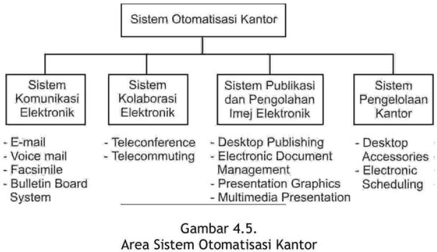

```{r load_packages, echo=FALSE}
library ('fontawesome')
```

## `r emo::ji('book')` Pendahuluan

Modul ini membahas aplikasi sistem-sistem informasi di organisasi. Setelah mempelajari dengan baik modul ini, Anda diharapkan mampu:

- [x] menjelaskan penerapan sistem informasi dalam di fungsi-fungsi organisasi;
- [x] memahami apa yang disebut dengan sistem pengolahan transaksi;
- [x] memahami apa yang disebut dengan sistem informasi manajemen;
- [x] menjelaskan penerapan sistem informasi di level-level organisasi;
- [x] memahami sistem otomatisasi kantor;
- [x] mengaplikasikan sistem informasi;
- [x] memahami enterprise resource planning;
- [x] mengetahui strategi dalam kompetisi informasi;
- [x] menjelaskan hubungan dan arti penting sis tern informasi strategi bisnis;
- `r emo::ji('check')` menjelaskan tantangan dan peluang sistem informasi manajemen.

---

## `r emo::ji('blue_book')` KEGIATAN BELAJAR 1: Aplikasi Sistem Informasi di Fungsi-fungsi Organisasi

- Sistem informasi dapat diterapkan di dalam fungsi-fungsi organisasi atau
di tingkatan-tingkatan organisasi. 
- Jika struktur perusahaan didasarkan pada fungsi-fungsi organisasinya maka unit-
unit di perusahaan dikelompokkan ke dalam beberapa fungsi atau departemen, seperti akuntansi, keuangan, pemasaran, produksi, sumber daya manusia.

- Sistem informasi terdiri dari enam komponen, yaitu input, model, output,
teknologi, basis data, dan kontrol (lihat Modul 2).


- Jika keenam komponen sistem informasi ini diterapkan ke dalam fungsi-fungsi organisasi akan menj adi sistem-sistem informasi fungsional atau yang disebut dengan nama lain sistem informasi manajemen (*management information systems*).

- idem...sistem informasi akuntansi (*accounting information system*).
- idem...sistem informasi keuangan (*financial information system*).
- sistem informasi pemasaran (*marketing information system*).
- sistem informasi produksi (*production information system* atau *manufacturing information system*) 
- sistem informasi sumber daya manusia (*human resource information system*)

### A. SISTEM-SISTEM INFORMASI FUNGSIONAL

- Sistem informasi manajemen dapat digunakan untuk mendukung 
kegiatan-kegiatan yang ada di fungsi-fungsi bisnis --> *functional information system*


- SIA
- Sistem informasi pemasaran (SIMPEM) 
- Sistem Informasi Produksi (SIMPRO) 
- Sistem Informasi Somber Daya Manusia 
- Sistem Informasi Keuangan

### B. ENTERPRISE RESOURCE PLANNING (ERP)

- Enterprise Resource Planning (ERP) adalah suatu perangkat lunak paket 
dengan aplikasi yang terintegrasi untuk digunakan secara luas di organisasi.

---

## `r emo::ji('blue_book')` KEGIATAN BELAJAR 2: Implementasi Keperawatan Komunikasi
### A. SISTEM-SISTEM INFORMASI DI LEVEL BAWAH 

- Tujuan utama dari sistem 
informasi di level ini adalah untuk menjawab pertanyaan-pertanyaan rutin 
untuk keperluan mengontrol arus dari transaksi yang terjadi di organisasi. 


### B. SISTEM-SISTEM INFORMASI DI LEVEL MENENGAH 

- Digunakan untuk 
pengendalian dan pengambilan keputusan manajemen yang sifatnya setengah 
terstruktur (*semi structured*),

- Sistem pakar (SP) atau expert Systems (ES), jaringan neural buatan (JNB) atau 
artificial neural network (ANN), sistem penunjang keputusan (SPK) atau 
decision support systems (DSS) atau group support systems (GSS), sistem 
informasi geografis (SIG) atau geographic information systems (GIS). 

### C. SISTEM-SISTEM INFORMASI DI LEVEL ATAS 

- Sistem informasi eksekutif (SIE) atau executive information system (EIS) 
adalah sistem informasi yang digunakan oleh manajer tingkat atas untuk 
membantu pemecahan masalah tidak terstruktur (*unstructured*).

### D. SISTEM OTOMATISASI KANTOR 

- Sistem informasi berbasis 
telekomunikasi yang mengumpulkan, memproses, menyimpan dan 
mendistribusikan pesan-pesan, dokumen-dokumen dan komunikasi 
elektronik lainnya di antara individual, grup-grup kerja dan organisasi-
organisasi.

- Menghubungkan ke tiga level manajemen




---


## `r emo::ji('blue_book')` KEGIATAN BELAJAR 3: Aplikasi Sistem Informasi Untuk Keunggulan Kompetitif


### A. SISTEM INFORMASI STRATEGIK 

- Mengimplementasikan satu atau lebih strategi-strategi 
kompetisi. 
- Tiga strategi umum yang biasanya perusahaan menerapkan untuk 
menghadapi pesaing-pesaingnya: *cost leadership*, *differentiation*, dan *focus*.

#### 1. Cost Leadership Strategy 

-  Mendukung posisi sebagai produsen dengan biaya terendah di dalam industri, 
yaitu dengan cara: 
   + menurunkan secara drastis biaya proses bisnis dengan melakukan 
rekayasa proses bisnis (business process reengineering), 
   + menurunkan biaya dari pemasok, dan 
   + menurunkan biaya ke pelanggan. 

#### 2. Differentiation Strategy 

- mendukung penyediaan produk atau jasa yang berbeda atau unik dengan nilai yang 
lebih besar kepada pelanggan dibandingkan dengan pesaing-pesaingnya.

#### 3. Focus Strategy 

- Suatu sistem informasi dikatakan mendukung strategi ini jika dapat 
membantu perusahaan memfokuskan pada produk atau jasa khusus di suatu 
niche khusus di dalam organisasi.

### B. SISTEM INFORMASI ANTAR ORGANISASI 

- Menghubungkan antara perusahaan 
dengan pemasok dan perusahaan dengan pelanggan secara on-line.
  + Industri penerbangan dan perhotelan, yaitu perusahaan-perusahaan 
penerbangan, jaringan hotel, agen-agen perjalanan dan konsumen dihubungkan dengan suatu 
jaringan sistem pemesanan booking pesawat dan penginapan.
  + Perbankan: bank-bank dihubungkan dengan nasabah dengan menggunakan e-banking, ATM
  + Bursa efek: investor, emiten, regulator, etc.
  
<br />

<!-- AddToAny BEGIN -->
<div class="a2a_kit a2a_kit_size_16 a2a_default_style"; data-a2a-url="https://bangtedy.github.io/sim" data-a2a-title="Aplikasi Sistem Informasi">
<a class="a2a_button_whatsapp"></a>
<a class="a2a_button_telegram"></a>
<a class="a2a_button_facebook"></a>
<a class="a2a_button_twitter"></a>
</div>
<script async src="https://static.addtoany.com/menu/page.js"></script>
<!-- AddToAny END -->

